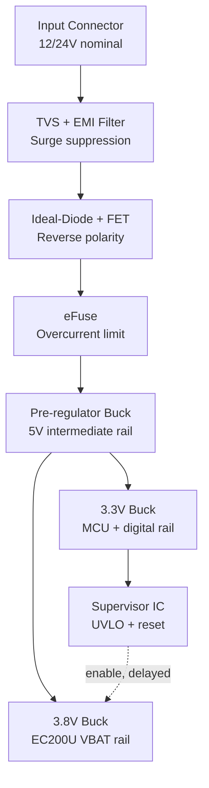

# README — Power Subsystem, EC200U-Based Telematics Tracker

## 1. Scope

This package covers only the power-path and protection architecture, from the vehicle/battery input connector through to the two regulated rails that feed the MCU and the Quectel EC200U cellular modem. It intentionally excludes MCU pinout, RF matching, and GNSS antenna path, per the assessment scope.

## 2. Assumptions and Constraints

These were fixed first, before any topology or component decisions, because every downstream choice depends on them.

| # | Assumption | Basis |
|---|---|---|
| A1 | Primary power source is vehicle-side, wide-range input: nominal 12 V or 24 V systems, with cranking dips and load-dump transients per ISO 7637-2 | Stated target: "vehicle-powered tracking device" |
| A2 | A battery-powered variant is a secondary case, sharing the same rails downstream of the reverse-polarity/eFuse stage, differing only in the input connector and TVS clamp voltage | Assessment allows either source type |
| A3 | Modem is Quectel EC200U-class (Cat-1/Cat-1bis with 2G fallback retained) | Stated in this exercise |
| A4 | Modem supply must never drop below 3.3 V, and must be able to source at least 3.0 A peak to cover the 2G-fallback case, not just the 2.0 A LTE-only case | Per Quectel EC200U hardware design guide |
| A5 | MCU + GNSS + peripheral rail peak current is 150 mA, average current is ~60 mA | Engineering assumption for a typical Cortex-M class MCU + GNSS receiver; not vendor-sourced — flagged as an assumption to revisit once real parts are selected |
| A6 | Device is a sealed, vehicle-mounted enclosure — thermal dissipation from any continuous-loss component (e.g. a series diode) is a real constraint, not just an efficiency nicety | Product form factor |
| A7 | Product is asset-tracking hardware, not a safety-critical ECU — margin policy and protection scope are set accordingly (25% current margin, not automotive-ECU-grade 30%+, and no supercap holdup stage) | Stated design philosophy, see Section 4 |

## 3. High-Level Power Architecture

Reading order: energy is progressively "narrowed" — from an uncontrolled, wide-range, bidirectional-fault-capable input down to two clean, narrow-tolerance rails. Each stage exists to remove one specific degree of freedom (transient amplitude, polarity, current magnitude, voltage tolerance) before the next stage has to deal with it.

## 4. Design Rationale and Trade-offs (summary)

Full reasoning lives in `POWER_DESIGN.md`; this is the short version for orientation.

- **Two-stage regulation (wide-in pre-reg → two narrow-in bucks), not one wide-in buck per rail.** A single-stage buck from 32 V down to 3.8 V runs at a duty cycle (~12%) that has poor transient response — exactly wrong for a modem TX burst. Cost: one extra conversion stage, ~2–4% additional loss.
- **Modem and MCU never share a rail.** A modem TX-burst transient sagging a shared rail could brown out the MCU. Cost: two regulators instead of one.
- **Reverse polarity via an active ideal-diode controller, not a series diode.** At 3 A burst, a diode's forward drop wastes 1–1.5 W and eats voltage headroom exactly when it's thinnest (cold crank, weak battery). Cost: one more IC, careful voltage margining against the TVS clamp level.
- **eFuse, not a PTC, for overcurrent.** Trips in microseconds instead of seconds, and can flag the MCU with a fault event before the rail collapses. Cost: higher part cost, current-limit threshold must be set with a margin above the legitimate TX-burst current to avoid nuisance trips.
- **Hardware supervisor gates modem enable off the MCU rail, not firmware.** Removes a circular dependency — the rail firmware needs to exist, but can't be sequenced by firmware that doesn't exist yet.
- **Modem rail sized to 3.0 A (GSM-fallback figure), not 2.0 A (LTE-only figure).** Coverage gaps that trigger 2G fallback are disproportionately likely in exactly the environments this product operates in. Cost: larger inductor, higher-current-rated FETs.
- **No supercap/holdup stage.** A modem brownout costs a missed report cycle, recoverable by firmware buffer-and-retry — not a safety event. Adding holdup capacitance would solve a firmware-solvable problem in (more expensive) silicon.

## 5. Document Map

| File | Contents |
|---|---|
| `README.md` | This file — assumptions, architecture overview, rationale summary |
| `POWER_DESIGN.md` | Current budget, protection justification, rail sizing math |
| `VALIDATION_PLAN.md` | Test matrix, pass/fail thresholds, worst-case stress scenario, risk/fallback plan |
| Power-path schematic | Power path only, input connector through both regulated rails |
